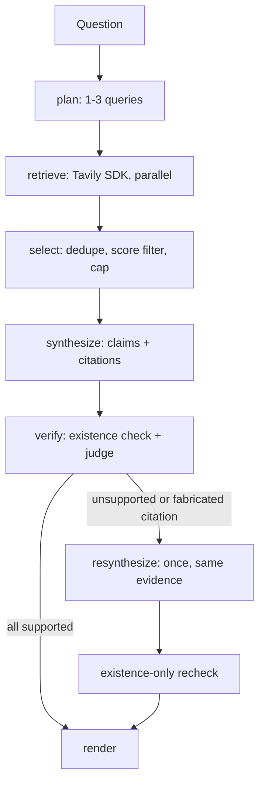

# Tavily Research Agent

A small, bounded research pipeline built on Tavily search whose central goal is
**grounding**: every claim in an answer is either backed by a real, checked citation, or
visibly flagged as unverified — never silently presented as fact.

This started as an improvement to a minimal LangChain + Tavily agent CLI (an unconfigured
`TavilySearch` tool behind a "cite when available" prompt, with no retrieval
configuration, no structural grounding guarantee, no evaluation loop, and no
observability). Rather than add features on top of that agent loop, this rebuilds it as a
small deterministic pipeline purpose-built around citation trust, evaluation, and
debuggability. See `STATEMENT.md` for the reasoning behind that call and the trade-offs
accepted along the way.

## Architecture



1. **plan** — one LLM call decomposes the question into 1-3 focused searches (topic +
   time range per query), hard-capped in code regardless of what the model returns. Most
   questions collapse to a single query; only genuinely multi-facet questions get split.
2. **retrieve** — each planned query is run once, in parallel, via the `tavily-python`
   SDK directly (not the LangChain tool wrapper — see `STATEMENT.md`). A single query's
   failure doesn't abort the run; it's recorded and the pipeline proceeds with whatever
   succeeded.
3. **select** — pools results across queries, dedupes by URL (keeping the higher-scoring
   duplicate), drops anything below a relevance-score threshold, and caps the evidence
   set passed to synthesis.
4. **synthesize** — one LLM call turns the evidence into a list of discrete claims, each
   citing the specific evidence id(s) it draws from.
5. **verify** — two independent checks: a deterministic citation-existence check (does
   the cited id actually exist in the evidence set?) and a batched LLM judge call (does
   the cited text actually support the claim?).
6. **resynthesize** (conditional) — if verification finds a problem, the model gets
   exactly one corrective pass using the *same* evidence — no new search, no retry loop.
   The corrected output is existence-rechecked (not re-judged) and rendered regardless of
   outcome; what happened is disclosed in metadata, not the answer text.

Best case: 3 LLM calls (plan, synthesize, judge) + up to 3 parallel Tavily calls. Worst
case: 4 LLM calls (+ resynthesize). No open-ended loop anywhere.

## Setup

Requires Python 3.11+ and [`uv`](https://docs.astral.sh/uv/).

```bash
cp .env.example .env
# fill in TAVILY_API_KEY (https://app.tavily.com) and NEBIUS_API_KEY (https://tokenfactory.nebius.com)

uv sync --extra dev --extra tracing   # both extras: `uv sync` isn't additive across
                                       # separate calls, so installing them together here
                                       # avoids a later sync silently dropping pytest.
                                       # Tracing stays off at runtime unless ENABLE_TRACING=1.
```

## CLI usage

```bash
uv run cli.py "What changed in the AI search market this year?"
uv run cli.py "..." --model <nebius-model-name>   # override the default model
```

The CLI runs are not streamed token-by-token like a single agent call — this is a
multi-stage batch pipeline, so there's one status spinner for the run, then the rendered
answer, a sources table, and a debug/quality metadata panel (planned queries, evidence
count, LLM call count, per-stage timings, verdicts, and whether a correction pass fired).

## Testing

```bash
uv run pytest
```

23 tests, all using mocked LLM/Tavily clients — no network access or API keys required.
Coverage focuses on the logic where correctness actually matters for the grounding
guarantee: evidence selection (dedupe/threshold/cap), the citation-existence check, judge
call accounting, fail-safe handling when the judge's output can't be matched to the
claims it was given, the bounded resynthesis state machine (asserted to fire at most
once and never re-invoke the judge), and that an invalid citation can't remain visible in
the rendered answer. It's intentionally scoped to this deterministic logic rather than
exhaustive coverage — there is no automated live-API integration test yet, though the
pipeline has been manually validated against live Tavily/Nebius APIs (see Evaluation
below and `STATEMENT.md`).

## Evaluation

```bash
uv run eval/run_eval.py
```

Requires real API keys — this exercises the live pipeline, not mocks. Runs a small fixed
golden set (`eval/golden_queries.yaml`, 6 queries: 2 compound, meant to exercise the
planner's multi-query decomposition; 2 simple factual; 2 deliberately narrow/obscure,
likely to produce thin evidence and plausibly trigger a correction pass). It redirects the
run logger to `runs/eval.jsonl` and reads that log back to build the report — the same
mechanism used for debugging, not a separate instrumentation path — printing per-query
verdicts, latency, and whether resynthesis fired, plus an aggregate initial-faithfulness
percentage.

**Real results from a live run** (6 queries, 35 total claims):

| category | queries | resynthesized | notes |
|---|---|---|---|
| compound | 2 | 2/2 | planner used 1 well-targeted query per question rather than splitting — a valid judgment call, see `STATEMENT.md` |
| simple | 2 | 1/2 | |
| thin_evidence | 2 | 0/2 | produced few, cautious claims rather than fabricating specifics |

Initial faithfulness rate: **31/35 (89%)** claims judged `supported` on first pass.
Zero judge-format mismatches and zero nonexistent citations occurred. Latency ranged
~4-22s per query, mostly driven by the judge and (when triggered) resynthesize calls.
Full detail, including a real overclaim the judge caught and resynthesis corrected, is in
`STATEMENT.md`.

## Observability

Two independent mechanisms:

- **Always-on JSONL run log** (`runs/runs.jsonl` by default, override via `RUN_LOG_PATH`)
  — every run appends one record: question, answer, both verification passes, and
  metadata (model, planned queries, evidence count, failed queries, per-stage timings,
  total latency, LLM call count). No setup required.
- **Optional OpenTelemetry tracing**, fully gated by `ENABLE_TRACING` and lazily
  initialized on first use (not at import time, so it works correctly regardless of when
  `.env` is loaded relative to importing the pipeline). When unset, or the `tracing`
  extra isn't installed, it's a true no-op — the pipeline behaves identically either way.
  When enabled, spans (one per stage) export via OTLP gRPC to whatever collector is
  configured (default `localhost:4317`), intended for a local Phoenix collector — not
  tied to any specific vendor. Spans currently carry stage name and timing only, not
  prompt/response payloads or token counts.

LangSmith was deliberately not used, to avoid a third tracing platform alongside the
user's existing Phoenix/OpenTelemetry setup and the separate Traces.com session recording
for this build.

## Failure behavior

- **No usable evidence** (every search failed, or nothing cleared the score threshold) →
  `NoEvidenceError`; the CLI reports it and exits non-zero.
- **A search query fails** (network/auth/etc.) → caught per-query in `retrieve()`; the
  run continues with whatever succeeded, and the failed query text is recorded in
  metadata and shown in the debug panel. Only escalates to `NoEvidenceError` if nothing
  usable survives overall.
- **A claim cites a nonexistent or missing source id** → caught by the deterministic
  existence check, triggers the one-shot resynthesis. If a citation is still invalid
  after the post-correction recheck, it's dropped from the rendered answer's citation
  markers (never shown as a working reference) but stays visible in the debug metadata.
- **The judge's output can't be matched to the claims it was given** (wrong count/order)
  → treated as a verification failure, not silently ignored: those claims are
  conservatively marked unsupported, which triggers the same one-shot correction, and the
  mismatch is flagged explicitly in the debug panel.
- **Anything else** (missing API keys, an LLM/API error, etc.) → propagates to the CLI's
  top-level handler, which reports it and exits non-zero. There is currently no
  retry/backoff on transient call failures (see `STATEMENT.md`).

## Reproduction steps

1. `cp .env.example .env` and fill in both API keys.
2. `uv sync --extra dev --extra tracing`
3. `uv run pytest` — confirms the pipeline logic without needing real keys.
4. `uv run cli.py "your question"` — a real end-to-end run.
5. `uv run eval/run_eval.py` — runs the golden set and prints a report.
6. Optional: set `ENABLE_TRACING=1` and `OTEL_EXPORTER_OTLP_ENDPOINT` in `.env`, point it
   at a local Phoenix collector — no extra install needed, step 2 already covers it.

## Repo layout

```
agent/
  models.py     — schemas shared across stages
  prompts.py    — plan / synthesize (shared by resynthesize) / judge prompt templates
  clients.py    — the only module touching external APIs (Tavily SDK, LLM)
  pipeline.py   — the six-stage orchestrator, run logger, optional tracing
cli.py          — CLI entry point (typer + rich)
eval/
  golden_queries.yaml
  run_eval.py
tests/
  test_pipeline.py   — pipeline logic (mocked)
  test_cli.py        — debug panel rendering
  test_tracing.py    — lazy tracer initialization
```
